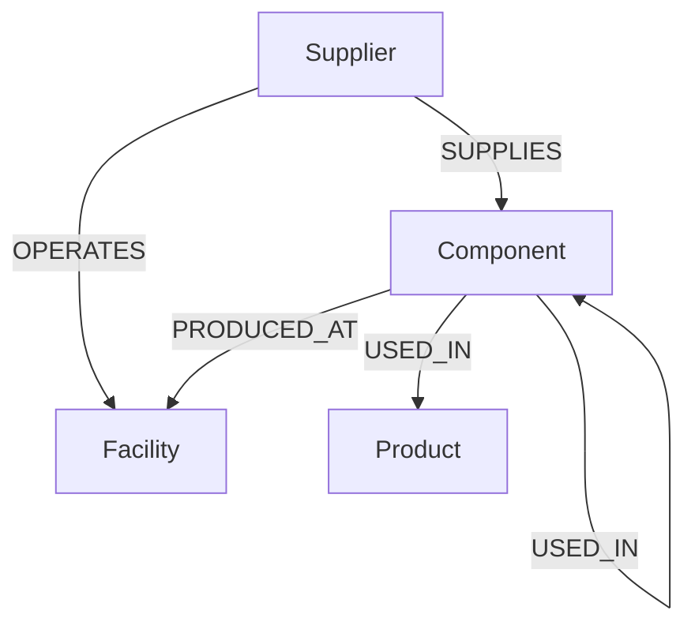

# ChainGuard

ChainGuard is a graph-backed supply chain traceability and risk analysis control tower application. Powered by **CognoDB** and **Express.js**, it simulates disruptions in multi-tier supply networks, computes cascading financial exposures, and recommends alternative suppliers using multi-criteria resilience scoring.

---

## 1. Overview

Global supply chains are multi-tiered and highly interdependent. A disruption at a Tier-3 sub-component supplier (e.g., semiconductor chip plants or capacitor fabs) can ripple upwards, halting the assembly of Tier-1 sub-assemblies and eventually delaying final products. 

ChainGuard solves this transparency issue by mapping the entire supply chain network as a graph. It allows supply chain managers to trace components from raw materials to consumer products, simulate the disruption of any supplier or facility, calculate the distinct **Monthly Revenue at Risk**, and instantly identify qualified alternative vendors.

---

## 2. Why a Graph Database?

Relational databases (SQL) are highly optimized for transactional rows and columns but struggle with deep, hierarchical relationships:
*   **Recursive Bills of Materials (BOM):** Products are composed of components, which themselves are assemblies of sub-components at arbitrary levels of nesting. Querying this structure in SQL requires complex **Recursive Common Table Expressions (CTEs)** or an excessive number of joins. If the BOM depth changes, SQL queries become more cumbersome to express and maintain as BOM traversal depth and relationship complexity increase.
*   **Downstream Impact Tracing:** Finding paths from a failure node (e.g., a flooded plant) to final products is a path-traversal problem. SQL databases require multiple self-joins over a large schema. 
*   **The Cypher Advantage:** In a graph database, relationships are physical pointers. Cypher can traverse paths of arbitrary length natively using a simple pattern:
    ```cypher
    (c:Component)-[:USED_IN*1..5]->(p:Product)
    ```
    This variable-length pattern allows ChainGuard to traverse up to 5 levels of the assembly hierarchy directly, without requiring separate queries or fixed-depth joins.

---

## 3. Graph Data Model

The database represents a multi-tiered electronics manufacturing supply chain:



### Node Schema
*   **`Product`**: Represents the final consumer product.
    *   Properties: `sku` (string, unique ID), `name` (string), `category` (string), `price` (float), `monthlyDemand` (int)
*   **`Component`**: Represents raw materials, chips, or intermediate assemblies.
    *   Properties: `id` (string, unique ID), `name` (string), `category` (string), `cost` (float)
*   **`Supplier`**: Represents vendors supplying components or operating plants.
    *   Properties: `id` (string, unique ID), `name` (string), `country` (string), `riskRating` (string: `"LOW"`, `"MEDIUM"`, `"HIGH"`)
*   **`Facility`**: Represents physical manufacturing or processing plants.
    *   Properties: `id` (string, unique ID), `name` (string), `city` (string), `country` (string), `riskRating` (string: `"LOW"`, `"MEDIUM"`, `"HIGH"`)

### Relationship Schema
*   `(:Supplier)-[:OPERATES]->(:Facility)`: A supplier owns/operates a facility.
*   `(:Supplier)-[:SUPPLIES { price: Float, leadTimeDays: Int, capacity: Int }]->(:Component)`: A supplier provides a component under specific pricing, lead time, and capacity constraints.
*   `(:Component)-[:PRODUCED_AT]->(:Facility)`: A component is manufactured at a specific plant.
*   `(:Component)-[:USED_IN { quantity: Float }]->(:Component)`: A sub-component goes into an intermediate assembly.
*   `(:Component)-[:USED_IN { quantity: Float }]->(:Product)`: A component goes directly into a finished product.

---

## 4. Key Cypher Queries

These queries are stored in `queries/` and read dynamically at server startup.

### Dashboard Metrics
Computes independent counts for dashboard metrics using isolated `CALL {}` blocks to prevent row-multiplication side-effects:
```cypher
CALL {
    MATCH (p:Product)
    RETURN count(p) AS products
}
CALL {
    MATCH (c:Component)
    RETURN count(c) AS components
}
CALL {
    MATCH (s:Supplier)
    RETURN count(s) AS suppliers
}
CALL {
    MATCH (f:Facility)
    RETURN count(f) AS facilities
}
CALL {
    OPTIONAL MATCH (hs:Supplier) WHERE hs.riskRating = 'HIGH'
    RETURN count(hs) AS highRiskSuppliers
}
CALL {
    OPTIONAL MATCH (hf:Facility) WHERE hf.riskRating = 'HIGH'
    RETURN count(hf) AS highRiskFacilities
}
RETURN products, components, suppliers, facilities, highRiskSuppliers, highRiskFacilities
```

### BOM Explorer
Traverses recursively from components to a final product, collecting quantities along the path and returning depth:
```cypher
MATCH (p:Product {sku: $sku})
MATCH path = (c:Component)-[:USED_IN*1..5]->(p)
OPTIONAL MATCH (s:Supplier)-[:SUPPLIES]->(c)
RETURN 
    c.id AS componentId,
    c.name AS componentName,
    c.category AS category,
    c.cost AS cost,
    s.id AS supplierId,
    s.name AS supplierName,
    s.riskRating AS supplierRisk,
    [r IN relationships(path) | r.quantity] AS quantities,
    length(path) AS depth
ORDER BY depth ASC
```

### Supplier Disruption
Traces cascading failures from a disrupted supplier downstream through all assemblies to final products, calculating individual revenue impacts:
```cypher
MATCH (s:Supplier {id: $supplierId})
MATCH (s)-[:SUPPLIES]->(c:Component)
MATCH path = (c)-[:USED_IN*0..5]->(p:Product)
WITH p, collect(distinct c.name) as affectedComponents, min(length(path)) as pathDepth
RETURN 
    p.sku as sku, 
    p.name as name, 
    p.price as price, 
    p.monthlyDemand as monthlyDemand,
    p.price * p.monthlyDemand as monthlyRevenueAtRisk,
    affectedComponents,
    pathDepth
ORDER BY monthlyRevenueAtRisk DESC
```

### Facility Disruption
Traces failures downstream originating from a plant shutdown:
```cypher
MATCH (f:Facility {id: $facilityId})
MATCH (c:Component)-[:PRODUCED_AT]->(f)
MATCH path = (c)-[:USED_IN*0..5]->(p:Product)
WITH p, collect(distinct c.name) as affectedComponents, min(length(path)) as pathDepth
RETURN 
    p.sku as sku, 
    p.name as name, 
    p.price as price, 
    p.monthlyDemand as monthlyDemand,
    p.price * p.monthlyDemand as monthlyRevenueAtRisk,
    f.name as facilityName,
    f.riskRating as facilityRisk,
    affectedComponents,
    pathDepth
ORDER BY monthlyRevenueAtRisk DESC
```

### Alternative Suppliers
Finds alternative suppliers for a component, excluding the current supplier and high-risk suppliers:
```cypher
MATCH (c:Component {id: $componentId})
MATCH (alt:Supplier)-[r:SUPPLIES]->(c)
WHERE alt.id <> $currentSupplierId
  AND alt.riskRating IN ['LOW', 'MEDIUM']
RETURN 
    alt.id as id,
    alt.name as name,
    alt.riskRating as riskRating,
    alt.country as country,
    r.price as price,
    r.leadTimeDays as leadTimeDays,
    r.capacity as capacity
```

---

## 5. Business Logic

### Multiplicative BOM Quantity
For a component $C$ connected to a final product $P$ via nested assemblies (e.g. $C \xrightarrow{q_2} C_{assembly} \xrightarrow{q_1} P$), the required unit quantity per finished product is multiplicative:
$$\text{requiredQuantityPerProduct} = \prod_{i=1}^{n} q_i$$
We calculate this by reducing the path quantities array in the Node.js application layer:
```javascript
const requiredQuantityPerProduct = quantities.reduce((a, b) => a * b, 1);
```

### Revenue at Risk
Rather than summing duplicate paths which would artificially inflate risk metrics, ChainGuard identifies the list of **distinct** affected products and computes the exposure:
$$\text{Monthly Revenue at Risk} = \sum (\text{distinctProduct.price} \times \text{distinctProduct.monthlyDemand})$$

### Resilience Scoring
ChainGuard ranks alternative suppliers using a 4-factor weighted score (0–100):
1.  **Risk Rating (40%):** `"LOW"` = 100 points, `"MEDIUM"` = 60 points.
2.  **Capacity Fit (25%):** `capacity >= requiredMonthlyVolume` = 100 points, else = 20 points.
3.  **Price Competitiveness (20%):** Normalized as $100 \times \frac{\text{minPriceAmongAlternatives}}{\text{candidatePrice}}$.
4.  **Lead Time Speed (15%):** Normalized as $100 \times \frac{\text{minLeadTimeAmongAlternatives}}{\text{candidateLeadTimeDays}}$.

$$\text{Resilience Score} = 0.40(S_{\text{Risk}}) + 0.25(S_{\text{Capacity}}) + 0.20(S_{\text{Price}}) + 0.15(S_{\text{LeadTime}})$$

### Capacity Constraints
If a candidate supplier's capacity is lower than the calculated `requiredMonthlyVolume` ($\text{Product.monthlyDemand} \times \text{requiredQuantityPerProduct}$), the UI flags them with a red `INSUFFICIENT CAPACITY` alert and penalizes their score.

### Risk Severity
The overall simulated disruption is classified into four severity levels:
*   **LOW:** $< \$250,000$ / month
*   **MEDIUM:** $\$250,000 \le x < \$1,000,000$ / month
*   **HIGH:** $\$1,000,000 \le x < \$3,000,000$ / month
*   **CRITICAL:** $\ge \$3,000,000$ / month

---

## 6. Architecture

ChainGuard follows a lightweight single-repository layered structure:

```
            +-----------------------------------------+
            |              Client Browser             |
            |     HTML5 / CSS / Tailwind / vis-network|
            +--------------------+--------------------+
                                 | HTTP REST
                                 v
            +--------------------+--------------------+
            |             Express.js Server           |
            |      API Routes & Business Logic Math   |
            +--------------------+--------------------+
                                 | Bolt Protocol (TLS)
                                 v
            +--------------------+--------------------+
            |               CognoDB Cloud             |
            |             Graph Data Store            |
            +-----------------------------------------+
```

---

## 7. Getting Started

### CognoDB Setup
1. Sign up for a free account at [console.cognodb.com/signup](https://console.cognodb.com/signup).
2. Create a free **c0** instance.
3. Copy the **Connection URI** (e.g., `bolt+s://db-xxxxxx.databases.cognodb.cloud`) and the generated database **password** for user `cognodb`.

### Environment Configuration
Create a `.env` file in the `chainguard/` directory:
```env
COGNODB_URI=bolt+s://your-instance.databases.cognodb.cloud
COGNODB_USERNAME=cognodb
COGNODB_PASSWORD=your_database_password
PORT=3001
```

### Installation
Run the dependency installer:
```powershell
# Using the pre-packaged Node environment in the parent folder
..\.node\npm.cmd install
```

### Seed Database
Populate the database instance with the supply chain network dataset:
```powershell
..\.node\node.exe seed.js
```

### Run Application
Start the server:
```powershell
..\.node\node.exe server.js
```
Open `http://localhost:3001` in your browser.

---

## 8. API Endpoints

*   `GET /api/db-status`: Checks connectivity and returns database connection status.
*   `GET /api/metrics`: Dashboard aggregates (Total Products, Components, Suppliers, Facilities, High Risk counts).
*   `GET /api/products`: Full catalog.
*   `GET /api/suppliers`: Supplier directory.
*   `GET /api/facilities`: Facility directory.
*   `GET /api/bom/:sku`: BOM paths with multiplicative quantity calculations.
*   `POST /api/simulate`: Runs disruption calculations. Takes `{ type: "SUPPLIER"|"FACILITY", id: "ID" }`.
*   `GET /api/graph/product/:sku`: Product BOM nodes and edges formatted for vis-network.
*   `GET /api/graph/disruption/:type/:id`: Identifies affected nodes/edges for visual highlighting.

---

## 9. UI

*   **Dashboard:** Highlights summary cards and features a "Risk Monitor" tracking high-risk vendors and plants.
*   **Disruption Simulator:** Selects a supplier or facility to simulate shutdown, calculates financial revenue-at-risk, and lists ranked alternative suppliers.
*   **BOM Explorer:** Multi-level tree showing nested components, intermediate path quantifiers, and primary suppliers.
*   **Suppliers:** Full registry of suppliers, risk ratings, and quick simulation shortcuts.
*   **Graph Explorer:** Dynamic vis-network topology canvas. Clicking "Simulate Failure" makes disruption paths glow red.

---

## 10. Screenshots

*Place screenshot images here when deploying:*
*   **Dashboard Overview**: `public/screenshots/dashboard.png`
*   **Simulation Highlight**: `public/screenshots/simulation.png`
*   **BOM Explorer**: `public/screenshots/bom_explorer.png`

---

## 11. Deployment

### Hosted Demo
*   **Live App URL:** *[Insert your hosted demo link here, e.g., Render / Fly.io / Vercel]*
*   **CognoDB Status:** *[Active and running]*

### Repository
*   **GitHub Repository:** *[Insert your repository link here]*

### Recording
*   **Screen Recording Link:** *[Insert link to the video/screen-recording demonstrating the flows]*

---

## 12. Future Improvements

*   **IP/Geolocation mapping:** Integrate Mapbox/Leaflet to show physical facility locations on a world map.
*   **Alternate Route Costing:** Calculate the increased shipping costs and transport times when switching to alternative suppliers.
*   **Multi-currency Support:** Support global suppliers invoicing in EUR, JPY, and TWD, performing currency conversion.
